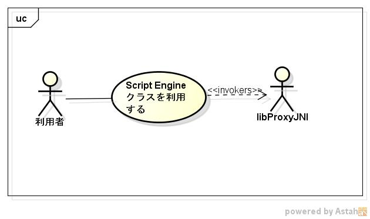

jniscrteng
==========
libproxyjniを利用して、javaのScriptEngineを呼び出すプログラムです。

## Description ##
  
## Demo ##

## VS. ##

## Requirement ##

libproxyjniに依存する(version 0.9のみ)  
(https://github.com/siranovel/libproxyjni.git)

## Usage ##
$ jniscrteng <js file> <upgrade-module-path>

## install ##
    git clone https://github.com/siranovel/jniscrteng.git  
    cd jniscrteng  
    rpm -ivh <rpmファイル名>  

## Contribution ##

## Licence ##

[GPLv2](LICENSE)

## Author ##

[siranovel](https://github.com/siranovel)
