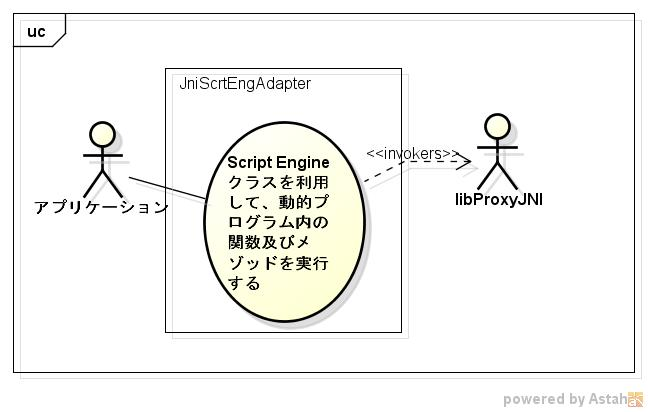
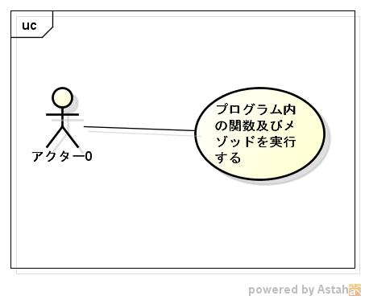

jniscrteng
==========
javaのScriptEngineを利用して、
動的プログラム(graaljs,jruby,jpython等)内の関数及びメゾッドを呼び出すライブラリです。

## Description ##
ver 0.9の場合  
  

ver 1.09の場合  
  

詳細は、
ライブラリ　https://github.com/siranovel/mydocs/jniscrteng/lib  
テスト      https://github.com/siranovel/mydocs/jniscrteng/test  

## Demo ##

## VS. ##

## Requirement ##

libproxyjniに依存する(version 0.9のみ)  
(https://github.com/siranovel/libproxyjni.git)  
java17以降(version 1.0以降)

## Usage ##
$ jniscrteng [ScriptFile] [UpgrageModulePath]

## install ##
    git clone https://github.com/siranovel/jniscrteng.git  
    cd jniscrteng  
    rpm -ivh <rpmファイル名>  

## Contribution ##

## Licence ##

[GPLv2](LICENSE)

## Author ##

[siranovel](https://github.com/siranovel)
